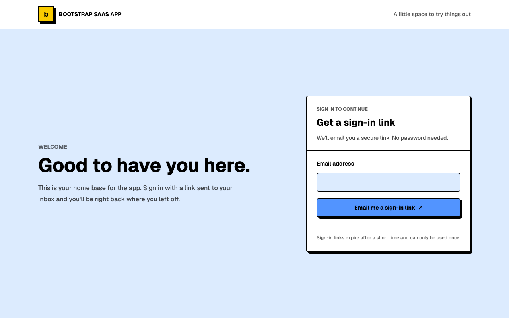

# Boostrap SaaS App

A personal starter for Next.js 16, Neon Postgres and Managed Auth, Drizzle ORM, Tailwind CSS v4, and shadcn/Neobrutalism UI.

The project keeps setup and development references in the internal docs site. For a fresh checkout, read [Getting started](src/app/docs/content/getting-started.tsx) and [Neon setup](src/app/docs/content/neon.tsx) on GitHub or in your editor first. Once configured, run `npm run dev` and open `/docs` on the URL Next.js prints. The links below assume port 3000; use your actual port if different.

## Internal docs

- [Getting started](http://localhost:3000/docs/getting-started): prerequisites and first-run setup.
- [Neon setup](http://localhost:3000/docs/neon): Neon project, environment variables, magic-link Auth, and production setup.
- [Database](http://localhost:3000/docs/database): Drizzle schema, connection, and database commands.
- [Development workflow](http://localhost:3000/docs/development-workflow): scripts, checks, routes, and how to add docs.
- [Biome and editor setup](http://localhost:3000/docs/biome): manual checks, live diagnostics, format-on-save, and safe fixes. [Read source](src/app/docs/content/biome.tsx).
- [UI conventions](http://localhost:3000/docs/ui-conventions): shared typography, shadcn primitives, and CSS modules.

## Main routes

- `/`: email magic-link sign-in.
- `/dashboard`: authenticated user dashboard.
- `/docs`: internal project documentation.
- `/docs/typography-gallery`: visual typography and color examples.
- `/docs/typography-debug`: typography wrapping and composition stress tests.

For fresh-project setup, follow [Getting started](http://localhost:3000/docs/getting-started) rather than copying credentials from this checkout. Each app should use its own Neon project and local environment values.

## Homepage screenshot

With the app running, run `npm run screenshot` to refresh `assets/homepage.png`.
For a different port or deployed site, pass its URL: `npm run screenshot -- http://localhost:3001`.
If Chromium is not installed, run `npx playwright install chromium` first.
README images live in `assets/`; temporary recordings stay in the ignored `recordings/` directory.
